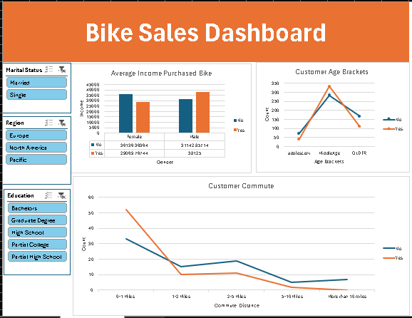

# 🚲 Bike Sales Dashboard

An interactive Excel dashboard built using PivotTables, slicers, and charts to explore customer bike purchase behavior.

## 📊 Features

- Filter by Marital Status, Region, Education
- Income vs. Gender visualization
- Customer Age Brackets
- Commute distance analysis

## 📂 Files

- `Bike_Sales_Dashboard.xlsx` — main Excel dashboard
- `dashboard_preview.png` — screenshot of the dashboard

## 🛠️ Tools Used

- Microsoft Excel (PivotTables, Slicers, Charts)

## 🖼️ Preview

